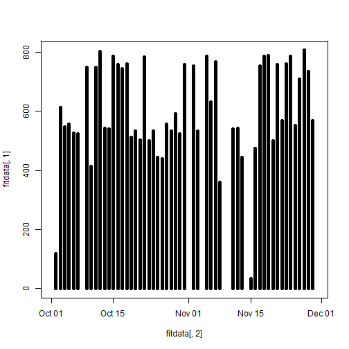
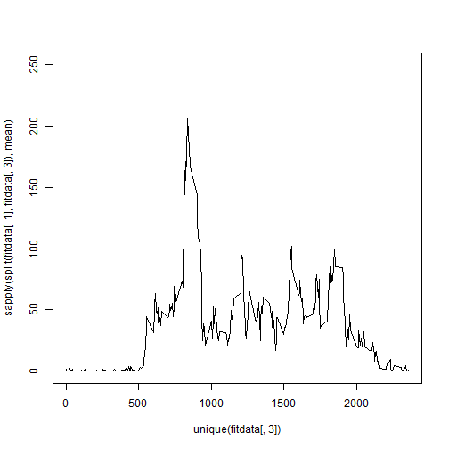
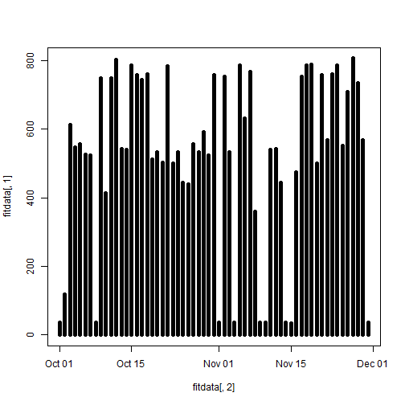
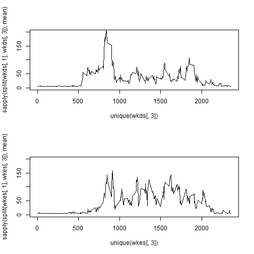

# Reproducible Research: Peer Assessment 1


## Loading and preprocessing the data

```r
fitdata<-read.csv("activity.csv")
fitdata[,2]<-as.Date(fitdata[,2], format="%Y-%m-%d")
```


## What is mean total number of steps taken per day?
- The histogram  


```r
plot(fitdata[,2], fitdata[,1], type="h", lwd="5")
```

 

- The mean steps taken per day  


```r
sapply(split(fitdata[,1], fitdata[,2]), mean)
```

```
## 2012-10-01 2012-10-02 2012-10-03 2012-10-04 2012-10-05 2012-10-06 
##         NA     0.4375    39.4167    42.0694    46.1597    53.5417 
## 2012-10-07 2012-10-08 2012-10-09 2012-10-10 2012-10-11 2012-10-12 
##    38.2465         NA    44.4826    34.3750    35.7778    60.3542 
## 2012-10-13 2012-10-14 2012-10-15 2012-10-16 2012-10-17 2012-10-18 
##    43.1458    52.4236    35.2049    52.3750    46.7083    34.9167 
## 2012-10-19 2012-10-20 2012-10-21 2012-10-22 2012-10-23 2012-10-24 
##    41.0729    36.0938    30.6285    46.7361    30.9653    29.0104 
## 2012-10-25 2012-10-26 2012-10-27 2012-10-28 2012-10-29 2012-10-30 
##     8.6528    23.5347    35.1354    39.7847    17.4236    34.0938 
## 2012-10-31 2012-11-01 2012-11-02 2012-11-03 2012-11-04 2012-11-05 
##    53.5208         NA    36.8056    36.7049         NA    36.2465 
## 2012-11-06 2012-11-07 2012-11-08 2012-11-09 2012-11-10 2012-11-11 
##    28.9375    44.7326    11.1771         NA         NA    43.7778 
## 2012-11-12 2012-11-13 2012-11-14 2012-11-15 2012-11-16 2012-11-17 
##    37.3785    25.4722         NA     0.1424    18.8924    49.7882 
## 2012-11-18 2012-11-19 2012-11-20 2012-11-21 2012-11-22 2012-11-23 
##    52.4653    30.6979    15.5278    44.3993    70.9271    73.5903 
## 2012-11-24 2012-11-25 2012-11-26 2012-11-27 2012-11-28 2012-11-29 
##    50.2708    41.0903    38.7569    47.3819    35.3576    24.4688 
## 2012-11-30 
##         NA
```

          
- The median steps taken per day  


```r
sapply(split(fitdata[,1], fitdata[,2]), median)
```

```
## 2012-10-01 2012-10-02 2012-10-03 2012-10-04 2012-10-05 2012-10-06 
##         NA          0          0          0          0          0 
## 2012-10-07 2012-10-08 2012-10-09 2012-10-10 2012-10-11 2012-10-12 
##          0         NA          0          0          0          0 
## 2012-10-13 2012-10-14 2012-10-15 2012-10-16 2012-10-17 2012-10-18 
##          0          0          0          0          0          0 
## 2012-10-19 2012-10-20 2012-10-21 2012-10-22 2012-10-23 2012-10-24 
##          0          0          0          0          0          0 
## 2012-10-25 2012-10-26 2012-10-27 2012-10-28 2012-10-29 2012-10-30 
##          0          0          0          0          0          0 
## 2012-10-31 2012-11-01 2012-11-02 2012-11-03 2012-11-04 2012-11-05 
##          0         NA          0          0         NA          0 
## 2012-11-06 2012-11-07 2012-11-08 2012-11-09 2012-11-10 2012-11-11 
##          0          0          0         NA         NA          0 
## 2012-11-12 2012-11-13 2012-11-14 2012-11-15 2012-11-16 2012-11-17 
##          0          0         NA          0          0          0 
## 2012-11-18 2012-11-19 2012-11-20 2012-11-21 2012-11-22 2012-11-23 
##          0          0          0          0          0          0 
## 2012-11-24 2012-11-25 2012-11-26 2012-11-27 2012-11-28 2012-11-29 
##          0          0          0          0          0          0 
## 2012-11-30 
##         NA
```


## What is the average daily activity pattern?

Time series plot of 5-minute interval vs average number of steps taken


```r
fitdata<-fitdata[complete.cases(fitdata),]
plot(unique(fitdata[,3]), sapply(split(fitdata[,1], fitdata[,3]), mean), type="l", ylim=c(0,250))
```

 

5-minute interval having the highest average steps taken per day


```r
temp=subset(fitdata, sapply(split(fitdata[,1], fitdata[,3]), mean)==max(sapply(split(fitdata[,1], fitdata[,3]), mean)))
unique(temp[,3])
```

```
## [1] 835
```
## Imputing missing values

Reloading the original file first containing NA values

```r
fitdata<-read.csv("activity.csv")
fitdata[,2]<-as.Date(fitdata[,2], format="%Y-%m-%d")
```

Then, find the number of rows containing missing values

```r
temp<-fitdata[complete.cases(fitdata),]
length(fitdata[,1])-length(temp[,1])
```

```
## [1] 2304
```

Creation of the new dataset. Logic is that the missing values
are replaced by the average of the number of steps taken over the entire two months


```r
fitdata[is.na(fitdata)]=floor(mean(fitdata[,1], na.rm=TRUE))
```

The histogram, means and medians with missing values replaced


```r
plot(fitdata[,2], fitdata[,1], type="h", lwd="5")
```

 

```r
sapply(split(fitdata[,1], fitdata[,2]), mean)
```

```
## 2012-10-01 2012-10-02 2012-10-03 2012-10-04 2012-10-05 2012-10-06 
##    37.0000     0.4375    39.4167    42.0694    46.1597    53.5417 
## 2012-10-07 2012-10-08 2012-10-09 2012-10-10 2012-10-11 2012-10-12 
##    38.2465    37.0000    44.4826    34.3750    35.7778    60.3542 
## 2012-10-13 2012-10-14 2012-10-15 2012-10-16 2012-10-17 2012-10-18 
##    43.1458    52.4236    35.2049    52.3750    46.7083    34.9167 
## 2012-10-19 2012-10-20 2012-10-21 2012-10-22 2012-10-23 2012-10-24 
##    41.0729    36.0938    30.6285    46.7361    30.9653    29.0104 
## 2012-10-25 2012-10-26 2012-10-27 2012-10-28 2012-10-29 2012-10-30 
##     8.6528    23.5347    35.1354    39.7847    17.4236    34.0938 
## 2012-10-31 2012-11-01 2012-11-02 2012-11-03 2012-11-04 2012-11-05 
##    53.5208    37.0000    36.8056    36.7049    37.0000    36.2465 
## 2012-11-06 2012-11-07 2012-11-08 2012-11-09 2012-11-10 2012-11-11 
##    28.9375    44.7326    11.1771    37.0000    37.0000    43.7778 
## 2012-11-12 2012-11-13 2012-11-14 2012-11-15 2012-11-16 2012-11-17 
##    37.3785    25.4722    37.0000     0.1424    18.8924    49.7882 
## 2012-11-18 2012-11-19 2012-11-20 2012-11-21 2012-11-22 2012-11-23 
##    52.4653    30.6979    15.5278    44.3993    70.9271    73.5903 
## 2012-11-24 2012-11-25 2012-11-26 2012-11-27 2012-11-28 2012-11-29 
##    50.2708    41.0903    38.7569    47.3819    35.3576    24.4688 
## 2012-11-30 
##    37.0000
```

```r
sapply(split(fitdata[,1], fitdata[,2]), median)
```

```
## 2012-10-01 2012-10-02 2012-10-03 2012-10-04 2012-10-05 2012-10-06 
##         37          0          0          0          0          0 
## 2012-10-07 2012-10-08 2012-10-09 2012-10-10 2012-10-11 2012-10-12 
##          0         37          0          0          0          0 
## 2012-10-13 2012-10-14 2012-10-15 2012-10-16 2012-10-17 2012-10-18 
##          0          0          0          0          0          0 
## 2012-10-19 2012-10-20 2012-10-21 2012-10-22 2012-10-23 2012-10-24 
##          0          0          0          0          0          0 
## 2012-10-25 2012-10-26 2012-10-27 2012-10-28 2012-10-29 2012-10-30 
##          0          0          0          0          0          0 
## 2012-10-31 2012-11-01 2012-11-02 2012-11-03 2012-11-04 2012-11-05 
##          0         37          0          0         37          0 
## 2012-11-06 2012-11-07 2012-11-08 2012-11-09 2012-11-10 2012-11-11 
##          0          0          0         37         37          0 
## 2012-11-12 2012-11-13 2012-11-14 2012-11-15 2012-11-16 2012-11-17 
##          0          0         37          0          0          0 
## 2012-11-18 2012-11-19 2012-11-20 2012-11-21 2012-11-22 2012-11-23 
##          0          0          0          0          0          0 
## 2012-11-24 2012-11-25 2012-11-26 2012-11-27 2012-11-28 2012-11-29 
##          0          0          0          0          0          0 
## 2012-11-30 
##         37
```

Because of using the logic given above, not much changes
in the dataset except that the mean and median of the days with NA values
previously increases

## Are there differences in activity patterns between weekdays and weekends?

Let's first create the two separate subsets

```r
fitdata$day<-weekdays(fitdata[,2])
wkds<-subset(fitdata, fitdata[,4]!="Saturday" & fitdata[,4]!="Sunday")
wkes<-subset(fitdata, fitdata[,4]=="Saturday" | fitdata[,4]=="Sunday")
```

Then, we plot the timeseries with the new datasets(after setting the mfrow appropriately)

```r
par(mfrow=c(2,1))
plot(unique(wkds[,3]), sapply(split(wkds[,1], wkds[,3]), mean), type="l", ylim=c(0,200))
plot(unique(wkes[,3]), sapply(split(wkes[,1], wkes[,3]), mean), type="l", ylim=c(0,200))
```

 
